# Pharo OCCT

Pharo OCCT is a Pharo/OpenCascade experiment for building and viewing CAD
shapes from Smalltalk. The repository contains:

- low-level UFFI bindings to the native OpenCascade C wrapper
- Smalltalk wrappers for OCCT shapes and primitive makers
- a CAD document model
- a Woden rendering bridge
- Spec presenters for the MyCAD workbench

## Install

Load the baseline from a Pharo Playground:

```smalltalk
Metacello new
  baseline: 'PharoOCCT';
  repository: 'github://mor3245/pharo_occt:master/src';
  onConflictUseIncoming;
  load.
```

The Playground should evaluate the script and show the loaded baseline state:

| Before | After |
| --- | --- |
|  |  |

The baseline loads the application packages and depends on the Woden scene graph
fork at:

```text
github://mor3245/woden-core-scene-graph:master
```

## Native Libraries

The OpenCascade wrapper is a native DLL. On Windows, keep the wrapper DLL and
its dependent OpenCascade DLLs beside the Pharo image. This lets the Windows DLL
loader find both `my_occt_c_wrapper.dll` and the OCCT DLLs it depends on without
installing anything OS-wide.

Use a C wrapper build that matches the Smalltalk code you loaded:

- If you loaded Pharo OCCT from `master`, compile the C wrapper from the
  matching `pharo_occt_cwrapper` source checkout.
- If you loaded a tagged Pharo OCCT release, use the C wrapper version named by
  that Smalltalk release. You can either download its Windows DLL bundle from
  the [pharo_occt_cwrapper releases page](https://github.com/mor3245/pharo_occt_cwrapper/releases)
  or compile it yourself from the corresponding source tag.

Then copy the DLLs into the directory that contains your `.image` file. Do not
mix the latest Smalltalk code with an older C wrapper release. The Smalltalk
wrapper and native DLL are versioned together because the UFFI calls must match
the exported C wrapper API.

For example, if Pharo Launcher shows an image named
`pharo_opencascade_integrationX`, use `Show in folder` and copy the DLL files
into:


```text
C:\Users\morgan\Documents\Pharo\images\pharo_opencascade_integrationX
```

The final layout should look like this:

```text
C:\Users\morgan\Documents\Pharo\images\pharo_opencascade_integrationX\
  pharo_opencascade_integrationX.image
  pharo_opencascade_integrationX.changes
  my_occt_c_wrapper.dll
  TKBRep.dll
  TKPrim.dll
  TKernel.dll
  ...
```

Step by step:

1. Open Pharo Launcher.
2. Select the image that will run Pharo OCCT, for example
   `pharo_opencascade_integrationX`.
3. Right-click the image and choose `Show in folder`.
4. Open the downloaded `pharo_occt_cwrapper` release archive.
5. Copy `my_occt_c_wrapper.dll` and all shipped `.dll` dependency files from the
   archive into the image folder opened in step 3.
6. Restart the Pharo image if it was already running.

Do not copy only `my_occt_c_wrapper.dll` by itself. The wrapper depends on the
OpenCascade DLLs in the same release bundle. Also do not put the DLLs in a nested
subfolder under the image directory unless you also configure the Windows DLL
search path.

To check the path Pharo will use:

```smalltalk
MyOCPStLib uniqueInstance win32LibraryName
```

## Open The Workbench

After loading the baseline and placing the native DLLs, open the workbench from
the Pharo world menu:


Choose `Library > Pharo CAD` to start the MyCAD workbench. The workbench can
create box and cylinder primitives, import and export BREP files, select
objects, edit primitive dimensions, and apply transforms.

## Controls

Camera controls:

- Select: Left-click
- Zoom: Scroll
- Rotate view: Shift + Right-click
- Pan view: Ctrl + Right-click

## Current Features

- 1 Unit Model = 1mm
- Cylinder and box basic shapes
- Import/export BREP files
- Boolean cut operations
- Rotation and translation
- Geometry class runtime inspection
- Default CAD navigation controls

## Known Limitations

  not a complete production CAD environment.
- Built-in primitive creation is currently limited to boxes and cylinders.
- Document persistence is based on BREP import/export; there is not yet a full
  MyCAD project file format for saving UI state, selection state, or editing
  history.
- Boolean operations depend on valid OpenCascade input shapes and may need
  follow-up inspection when imported or generated geometry is complex.
- Rendering is functional but not yet sophisticated.

## Workbench Examples

The MyCAD workbench supports a small CAD workflow from primitive creation to
runtime shape inspection.

### Primitive Shapes

Box and cylinder primitives can be created directly in the workbench. Primitive
objects appear in the geometry tree and expose their editable dimensions in the
property panel.

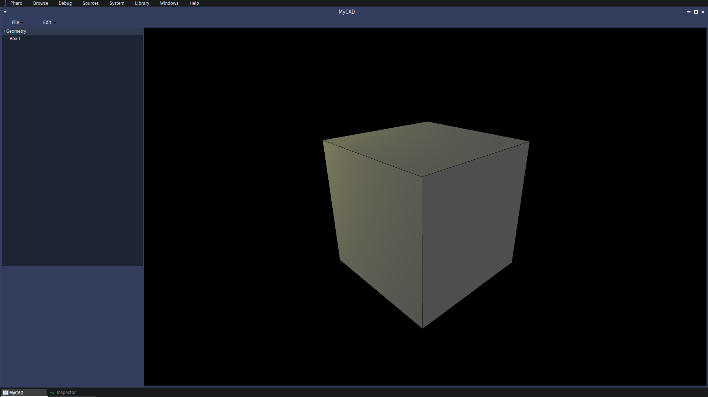

### Workbench Overview

The main workbench keeps the document tree, property panel, viewport, transform
panel, and shape context menu visible together. This gives one place to select
geometry, edit primitive dimensions, apply translations or rotations, fit the
camera, import or export BREP files, and inspect the selected runtime object.

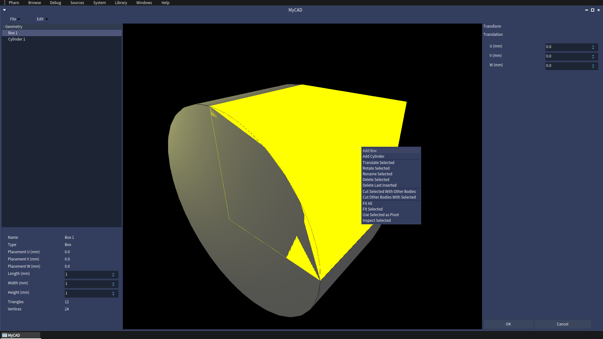

BREP results can be saved and loaded as shapes. This example shows a hollow
cylinder imported back into the workbench.

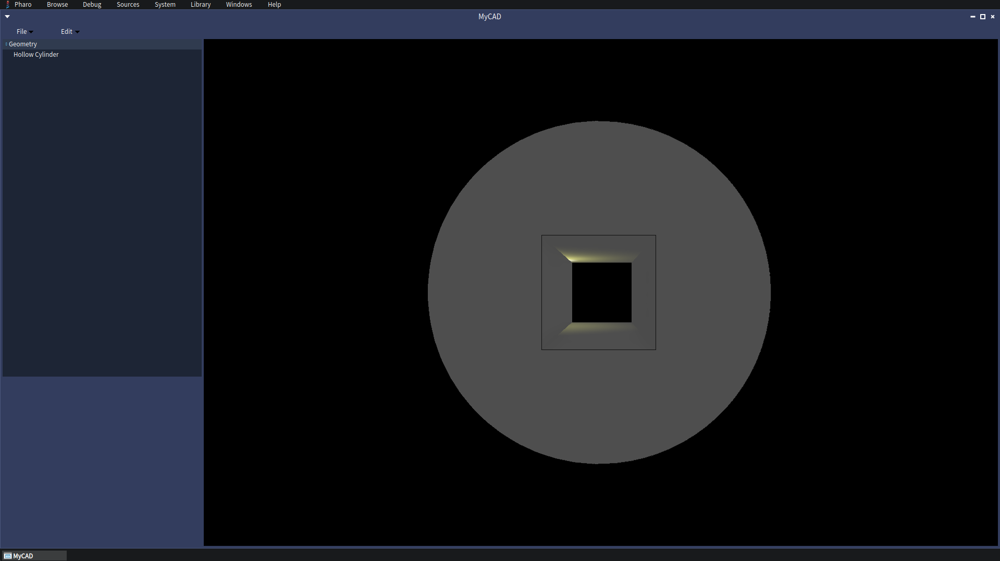

### Boolean Cut Workflow

Boolean cut operations work on selected bodies in the document. In this example,
two overlapping boxes are positioned so one body can be cut by the other.

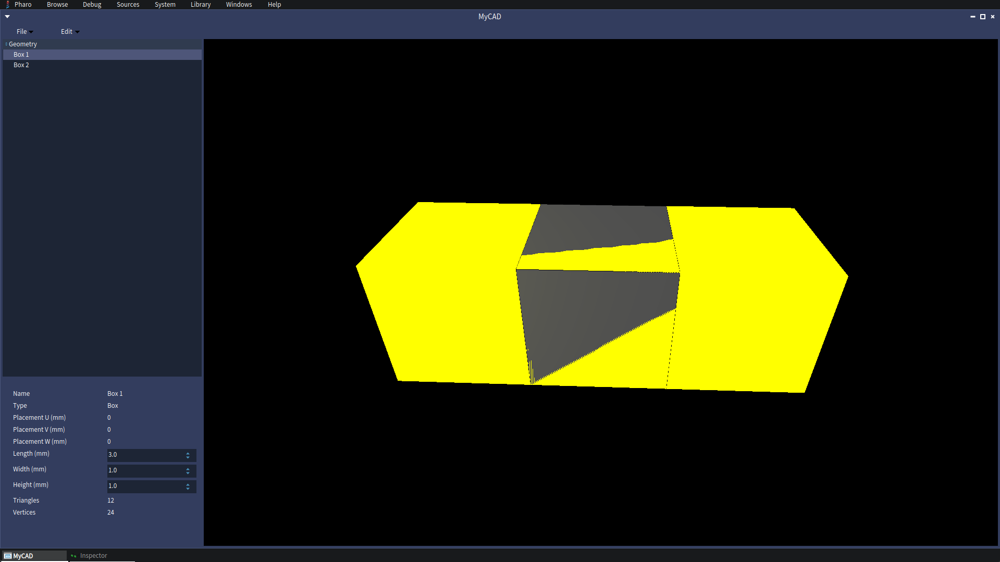

The selected body can then be used from the context menu with the cut commands.
`Cut Selected With Other Bodies` subtracts the other bodies from the selected
body, while `Cut Other Bodies With Selected` uses the selected body as the
cutting tool.

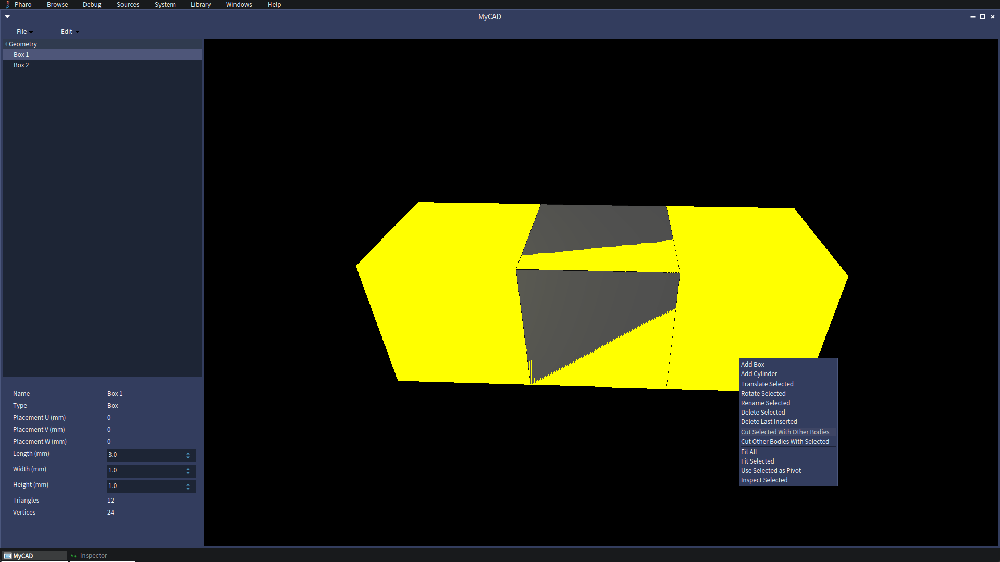

The result is added back into the geometry tree as a document object, alongside
the original bodies.

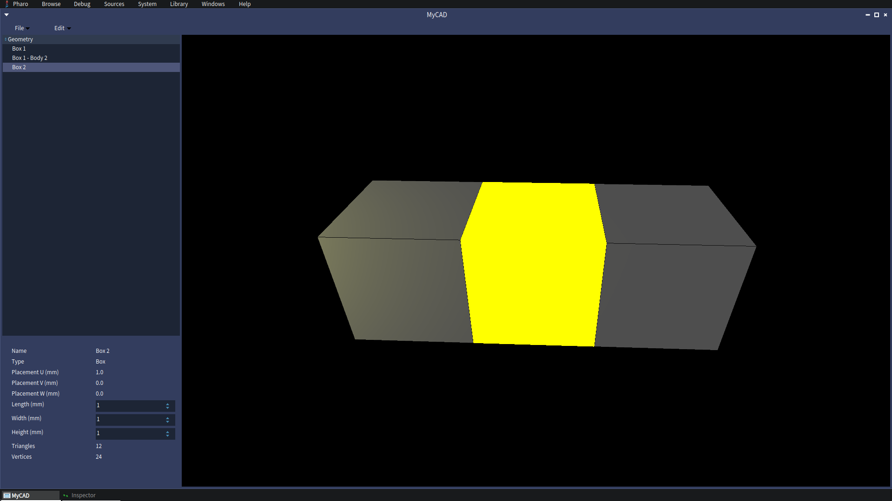

### BREP Import

Imported BREP files are loaded as document shapes and rendered through the same
Woden bridge as primitive geometry.

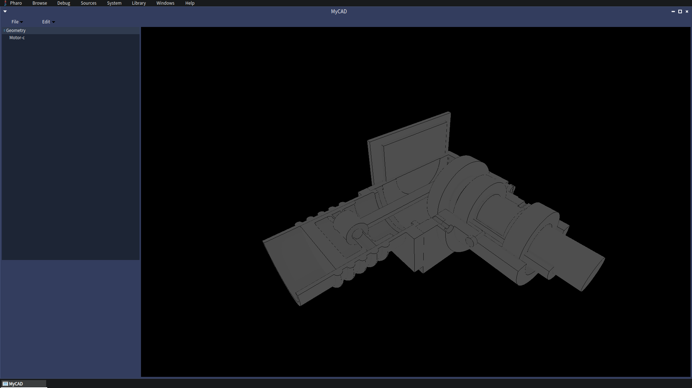

Imported shapes participate in selection, property display, and viewport
navigation. Selection highlighting is transient UI state, so it remains separate
from the persisted CAD object.

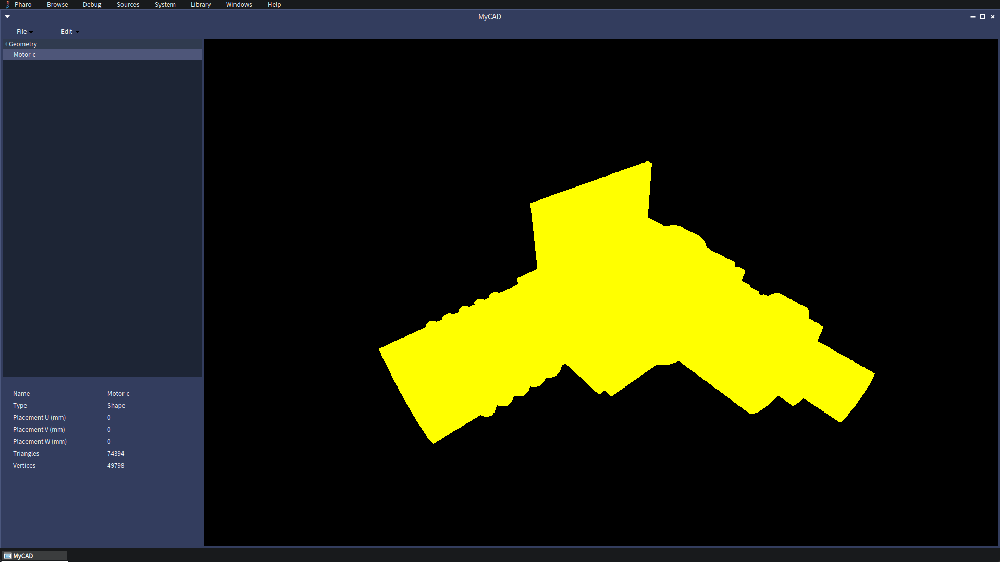

### Runtime Inspection

The Inspect Selected command opens Pharo inspectors on the rendered shape and
its wrapped OpenCascade topology. This is useful while developing the CAD object
model and wrapper layer because it exposes solids, shells, faces, wires, edges,
vertices, storage metadata, and mesh counts.

| Imported shape topology | Hollow cylinder topology |
| --- | --- |
| 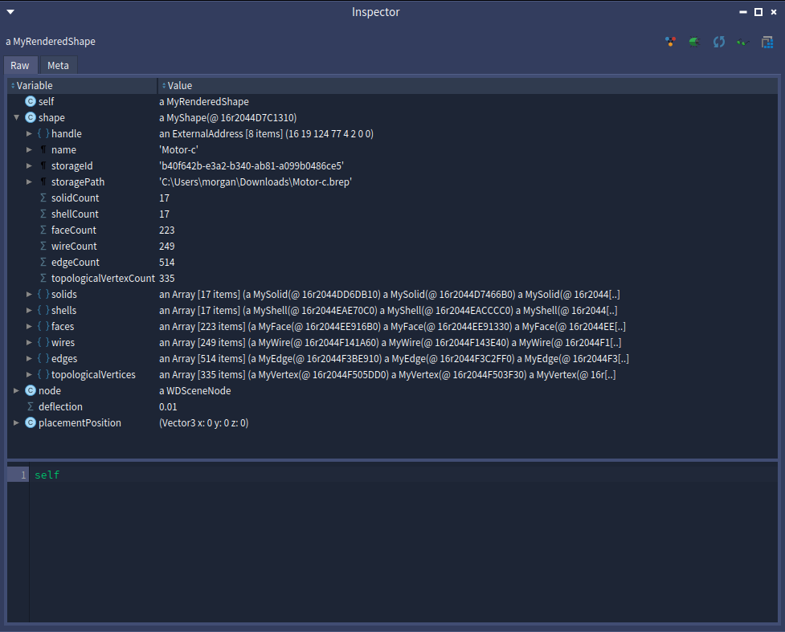 | 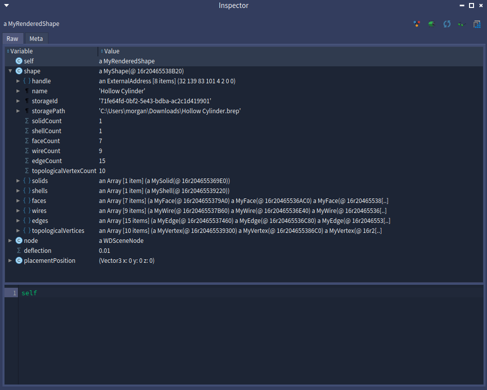 |

Nested topology objects can be expanded for primitive shapes as well, down to
individual faces, wires, edges, and vertices.

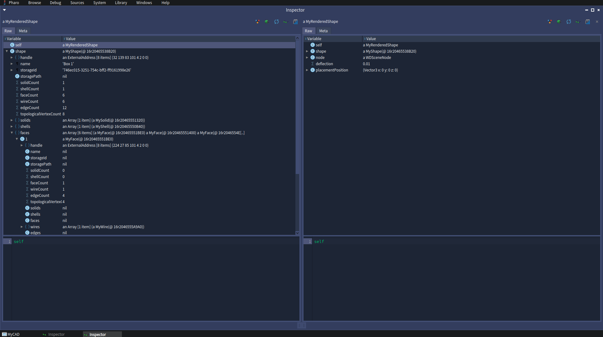

## Package Layout

- `LibImports-UFFI-CWrap`: native library lookup for the C wrapper
- `MyOpenCascade`: low-level OCCT/UFFI wrapper objects
- `MyOpenCascade-Rendering`: OCCT shape to Woden scene bridge
- `MyOpenCascade-Model`: CAD document and object model
- `MyOpenCascade-Spec`: Spec UI presenters
- `MyOpenCascade-API-Test`: native wrapper/API tests
- `MyOpenCascade-CAD-GUI-Test`: Spec/workbench CAD GUI tests
- `BaselineOfPharoOCCT`: Metacello baseline

## Acknowledgements

Pharo OCCT builds on Pharo, OpenCascade, Woden, and the related Smalltalk tooling communities.

Thanks to everyone who contributed ideas, testing, examples, and feedback while this project was taking shape, and to the Pharo community for being responsive and helpful.

Additional thanks to:

- Dr. Aik Siong Koh: for allowing me to take on this project, and for his encouragement and guidance
- Dr. Chai Ian: for being open to my outreach and helping this project get started
- Ronie Salgado: for developing Woden
