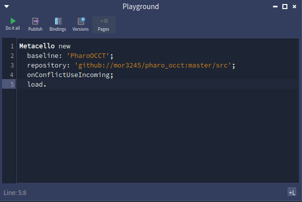
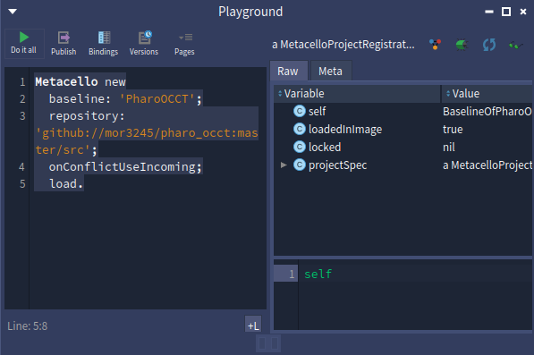
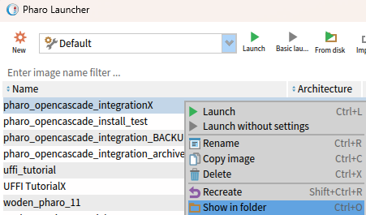
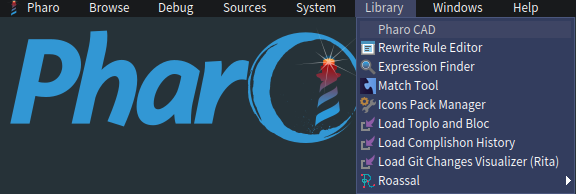

# Pharo OCCT

Pharo OCCT is a Pharo/OpenCascade experiment for building and viewing CAD
shapes from Smalltalk. The repository contains:

- low-level UFFI bindings to the native OpenCascade C wrapper
- Smalltalk wrappers for OCCT shapes and primitive makers
- a CAD document model
- a Woden rendering bridge
- Spec presenters for the MyCAD workbench

## Install

Load the baseline from a Pharo Playground:

```smalltalk
Metacello new
  baseline: 'PharoOCCT';
  repository: 'github://mor3245/pharo_occt:master/src';
  onConflictUseIncoming;
  load.
```

The Playground should evaluate the script and show the loaded baseline state:

| Before | After |
| --- | --- |
|  |  |

The baseline loads the application packages and depends on the Woden scene graph
fork at:

```text
github://mor3245/woden-core-scene-graph:master
```

## Native Libraries

The OpenCascade wrapper is a native DLL. On Windows, keep the wrapper DLL and
its dependent OpenCascade DLLs beside the Pharo image. This lets the Windows DLL
loader find both `my_occt_c_wrapper.dll` and the OCCT DLLs it depends on without
installing anything OS-wide.

Use a C wrapper build that matches the Smalltalk code you loaded:

- If you loaded Pharo OCCT from `master`, compile the C wrapper from the
  matching `pharo_occt_cwrapper` source checkout.
- If you loaded a tagged Pharo OCCT release, use the C wrapper version named by
  that Smalltalk release. You can either download its Windows DLL bundle from
  the [pharo_occt_cwrapper releases page](https://github.com/mor3245/pharo_occt_cwrapper/releases)
  or compile it yourself from the corresponding source tag.

Then copy the DLLs into the directory that contains your `.image` file. Do not
mix the latest Smalltalk code with an older C wrapper release. The Smalltalk
wrapper and native DLL are versioned together because the UFFI calls must match
the exported C wrapper API.

For example, if Pharo Launcher shows an image named
`pharo_opencascade_integrationX`, use `Show in folder` and copy the DLL files
into:



```text
C:\Users\morgan\Documents\Pharo\images\pharo_opencascade_integrationX
```

The final layout should look like this:

```text
C:\Users\morgan\Documents\Pharo\images\pharo_opencascade_integrationX\
  pharo_opencascade_integrationX.image
  pharo_opencascade_integrationX.changes
  my_occt_c_wrapper.dll
  TKBRep.dll
  TKPrim.dll
  TKernel.dll
  ...
```

Step by step:

1. Open Pharo Launcher.
2. Select the image that will run Pharo OCCT, for example
   `pharo_opencascade_integrationX`.
3. Right-click the image and choose `Show in folder`.
4. Open the downloaded `pharo_occt_cwrapper` release archive.
5. Copy `my_occt_c_wrapper.dll` and all shipped `.dll` dependency files from the
   archive into the image folder opened in step 3.
6. Restart the Pharo image if it was already running.

Do not copy only `my_occt_c_wrapper.dll` by itself. The wrapper depends on the
OpenCascade DLLs in the same release bundle. Also do not put the DLLs in a nested
subfolder under the image directory unless you also configure the Windows DLL
search path.

To check the path Pharo will use:

```smalltalk
MyOCPStLib uniqueInstance win32LibraryName
```

## Open The Workbench

After loading the baseline and placing the native DLLs, open the workbench from
the Pharo world menu:



Choose `Library > Pharo CAD` to start the MyCAD workbench. The workbench can
create box and cylinder primitives, import and export BREP files, select
objects, edit primitive dimensions, and apply transforms.

## Package Layout

- `LibImports-UFFI-CWrap`: native library lookup for the C wrapper
- `MyOpenCascade`: low-level OCCT/UFFI wrapper objects
- `MyOpenCascade-Rendering`: OCCT shape to Woden scene bridge
- `MyOpenCascade-Model`: CAD document and object model
- `MyOpenCascade-Spec`: Spec UI presenters
- `MyOpenCascade-UFFI-Test`: native wrapper tests
- `BaselineOfPharoOCCT`: Metacello baseline
